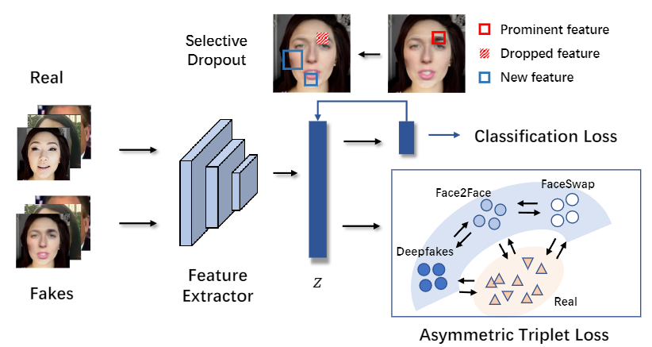

# Unknown Aware Feature Learning for Face Forgery Detection (FG2021)

This repository is the official implementation of the FG 2021 paper [Unknown Aware Feature Learning for Face Forgery Detection](https://ieeexplore.ieee.org/abstract/document/9666951/). 

## Overview

In this study, we leverage domain generalization to enhance face forgery detection with awareness to unknown forgery algorithms. In particular, we improve generalization of models by encouraging it to learn from non-salient areas with subtle artifacts.




## Preparations

- To install requirements:

```setup
pip install -r requirements.txt
```

- Download datasets at [FaceForensics++](https://github.com/ondyari/FaceForensics), [Celeb-DF](https://github.com/yuezunli/celeb-deepfakeforensics), etc.

- Run face detection. With cropped face images, generate json files in the following format:

```
[
    {
        "path": "path/to/image_0.png",
        "label": 0
    },

    {
        "path": "path/to/image_1.png",
        "label": 1
    },

    ...
]

```

- Link the json files in the config files to load the data. You can also just modify the dataset files to load the images in any other ways you want.


## Training

Make sure to specify paths to labels, pretrained models, as well as hyperparameters in ```configs/config.py```.

To train the baseline model:

```train
python train.py
```

To train the model with our proposed method:

```train
python train_gfsl.py
```


## Evaluation

Specify models to test in the aforementioned config files.

Evaluate the model by running:

```eval
python evaluate.py
```


## Reference
Consider citing our paper if you find it helpful:

```
@inproceedings{shi2021unknown,
  title={Unknown aware feature learning for face forgery detection},
  author={Shi, Liang and Zhang, Jie and Liang, Chenyue and Shan, Shiguang},
  booktitle={2021 16th IEEE International Conference on Automatic Face and Gesture Recognition (FG 2021)},
  year={2021},
  organization={IEEE}
}
```

Feel free to contact us with any comments or feedback.